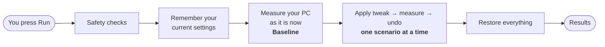
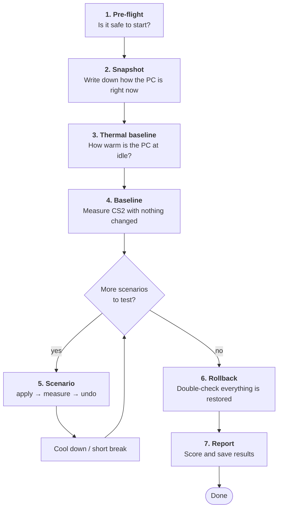
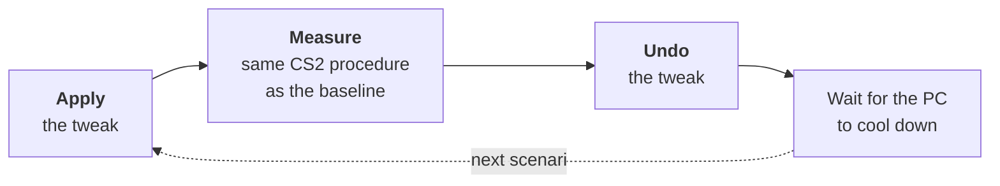
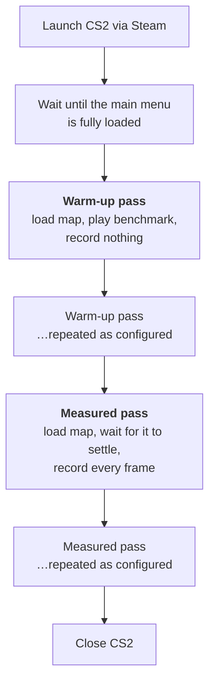
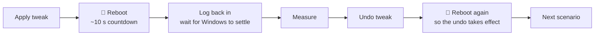

# 🎬 What Happens When You Press Run

| | |
| :--- | :--- |
| **Status** | Draft |
| **Last updated** | 2026-09-11 |
| **Audience** | Anyone about to start a VOIDFRAME benchmark — no technical background needed |

You built a project, picked a few tweaks to test, and now your finger is hovering over
**Run**. Then CS2 opens and closes by itself, your PC maybe reboots once or twice, and
half an hour later there's a results table. This guide explains **what VOIDFRAME is
actually doing during that time, in what order, and why** — so the process isn't a black
box and you know what's normal and what isn't.

> Once you have results, the companion guide
> [Understanding your benchmark results](understanding-your-benchmark-results.md)
> explains what the numbers mean.

---

## The one-sentence version

VOIDFRAME measures your **untouched PC first**, then applies **one tweak at a time**,
measures CS2 the exact same way each time, **undoes the tweak**, and finally compares
every tweak against that first untouched measurement.

Everything else in this guide is detail on top of that sentence.

---

## Why "one tweak at a time"?

If VOIDFRAME applied all your tweaks at once and FPS went up, you'd have no idea *which*
tweak did it — or whether one of them actually made things worse and was being masked by
another. So each tweak (VOIDFRAME calls it a **scenario**) gets its own isolated test:
apply it, measure, undo it. That's slower, but it's the only way to get an honest answer
per tweak.

This also means **your PC is only ever running one tweak at a time**, and never any of
them once the run is over.

---

## The run, step by step

Every run walks through the same fixed sequence. The Live Monitor shows the current step's
name at the top, so you can always tell where you are.

### 1. Pre-flight — "is it safe to start?"

Before touching anything, VOIDFRAME checks that the run can actually succeed. Think of it
as a pilot's checklist. Among other things it confirms that:

- Steam is running (VOIDFRAME will try to start it for you if it isn't).
- The benchmark map is installed, if your project uses the Workshop map.
- There's enough free disk space for the recordings.
- Nothing from a previous, crashed run is still lingering.
- If any scenario needs a reboot: Windows can log itself back in afterwards (see the
  [AutoLogon setup guide](autologon-setup.md)), and nothing like BitLocker will get in the
  way.

If a check fails, the run **stops here, before anything on your PC has been changed**, and
tells you what to fix. Some checks are only warnings — they let the run continue but
flag something you should know about.

### 2. Snapshot — "remember how things are right now"

VOIDFRAME writes down your current CS2 launch options, active Windows power plan, and the
exact CS2 build you have installed. This is the "before" picture that everything later
gets restored to and compared against.

It also drops a file named `VOIDFRAME_RESTORE.bat` on your Desktop. That's an emergency
"undo everything" button: if VOIDFRAME itself ever crashes mid-run and can't clean up,
double-clicking that file puts your PC back the way it was. It's removed automatically
when the run finishes normally.

### 3. Thermal baseline — "how warm is the PC when idle?"

If you've set up HWiNFO in Settings, VOIDFRAME takes a short reading of your CPU and GPU
temperatures **before** any gaming happens. Later, between scenarios, it waits until your
PC has cooled back down to roughly this level before starting the next one. That way
scenario 4 isn't unfairly tested on a PC that's still hot from scenario 3.

Without HWiNFO this step is skipped and the breaks between scenarios are a plain fixed
pause instead.

### 4. Baseline — "measure the PC with nothing changed"

This is the most important measurement of the whole run. VOIDFRAME launches CS2 and runs
the full benchmark procedure (described in the next section) with **none of your tweaks
applied**. Every scenario is later judged as "better or worse than *this*."

### 5. Scenarios — apply, measure, undo, repeat

Now the real work. For each scenario you enabled, in order:

- **Apply** — VOIDFRAME makes the change (a registry value, a power plan, a CS2 launch
  option…). Every single change is written to a **journal** *before* it's made, together
  with the value it's replacing. That journal is what makes undo — and crash recovery —
  reliable.
- **Measure** — CS2 is launched and benchmarked exactly the same way as the baseline was.
- **Undo** — the journal is replayed backwards, restoring each value to what it was.
- **Wait** — a cool-down (thermal, if HWiNFO is configured; otherwise a fixed pause)
  before the next scenario starts from a fair, cold-ish state.

A scenario is only ever measured *after* its tweak is live and *before* it's undone, so
the measurement always reflects that one tweak alone.

### 6. Rollback — "belt and braces"

Even though every scenario already undid itself, VOIDFRAME does one final sweep at the
end: it restores your original power plan and CS2 launch options, and checks every
journal from the run to make sure nothing was left half-applied. Only once this passes does
it move on, and only then is the Desktop restore file removed. Your PC leaves the run in
the same state it entered it.

### 7. Report — scoring and saving

Now that all measurements are in, VOIDFRAME compares each scenario against the baseline,
calculates the scores and verdict badges, and saves the results. This is the table you see
on the Results screen.

---

## Inside one measurement: what CS2 is doing

Every time you see CS2 open during a run, the same procedure plays out. This is the part
where you should **leave your mouse and keyboard alone** — VOIDFRAME is driving.

### Launch and wait for the menu

VOIDFRAME asks Steam to start CS2 with your normal launch options plus a couple it needs
for itself (notably `-condebug`, which makes CS2 write a log file VOIDFRAME reads to know
what the game is doing). It then waits until the game is actually at the main menu and
responsive, not just "the window appeared."

### Warm-up passes

The first pass or two are **never recorded**. Loading a map the first time is slower
(shaders compiling, files being cached), and that would drag the numbers down for reasons
that have nothing to do with your tweak. Warm-ups get that out of the way. The number of
warm-up passes is the `warmup_loops` setting in your project.

### Measured passes

Each measured pass does the same thing:

1. VOIDFRAME types the map-load command into the CS2 console for you.
2. It watches CS2's log file until the map reports it's actually loaded (not a timer —
   the real signal from the game).
3. It waits a few seconds for the loading screen and initial stutter to clear.
4. It **records every single frame** with PresentMon for the configured capture length.
   VOIDFRAME even freezes its own window during this so it can't interfere with the
   recording.
5. It waits for the benchmark to finish, then repeats.

The number of measured passes is the `measure_loops` setting. More passes = more
confident verdicts, but a longer run. The frame-by-frame recordings are kept on disk
after the run, so you can inspect them with other tools if you want.

### Close CS2

Once all passes are done, VOIDFRAME closes CS2 cleanly. The next scenario will launch it
fresh, so each scenario starts from an identical cold start.

> **If a map load hangs:** VOIDFRAME has a watchdog. If CS2 doesn't report the map as
> loaded within the configured time, it kills CS2, relaunches it, and retries once. If it
> fails a second time, the run is treated as failed and goes straight to Rollback so your
> PC is restored.

---

## Scenarios that need a reboot

Some tweaks (HAGS is the common one) only take effect after Windows restarts. VOIDFRAME
handles these on its own, but it changes the flow a little:

What to expect:

- **Before rebooting**, VOIDFRAME saves its exact position in the run, refreshes the
  Desktop restore file, and registers a scheduled task so it starts itself again after
  login. It then gives you a short countdown before Windows restarts.
- **After the reboot**, Windows needs to log in on its own — that's why Pre-flight insists
  on AutoLogon for these runs. VOIDFRAME starts back up, waits a while for Windows to
  finish its startup chores (drivers, Steam, background junk), and picks up exactly where
  it left off.
- **If the boot wasn't clean** (Windows reports it was a crash or forced restart),
  VOIDFRAME marks that scenario as **unstable** in the results instead of measuring it,
  undoes it, and carries on with the rest of the run.
- **The dead-man switch:** a second scheduled task is registered to fire about 10 minutes
  after boot if VOIDFRAME never resumed for some reason. It runs the recovery routine so
  your PC isn't left with a tweak stuck on.
- **Reboots are combined where possible.** When one reboot-scenario's undo and the next
  reboot-scenario's apply can share a single restart, VOIDFRAME does that instead of
  rebooting twice.

The Live Monitor shows how many reboots the run still has ahead of it.

---

## What you can do while it runs

| Control | What it does |
| :--- | :--- |
| **Pause** | Finishes the current benchmark pass, then waits before starting the next one. Nothing is left half-done. Press again to resume. |
| **Abort** | Stops the run as soon as it safely can: CS2 is closed, the current tweak is undone, the final Rollback sweep runs, and your PC is restored. Nothing is scored. |
| **Shut down when complete** | Instead of ending on the Results screen, the PC powers off after the run finishes and Rollback succeeds — handy for overnight runs. You get a 60-second notice with a cancel button. |

Two things worth knowing:

- Once a reboot has started, or once Rollback / Report have begun, Abort no longer does
  anything — those steps run to completion because stopping them halfway would be worse
  than finishing. The buttons grey out to show this.
- **Don't use the PC during a run.** Alt-tabbing, moving the mouse in CS2, opening a
  browser — all of it shows up in the frame data and pollutes the comparison. Start the
  run, walk away.

---

## If something goes wrong

VOIDFRAME is built around the idea that **your PC must always end up back where it
started**, whatever happens. The layers, from most to least routine:

1. **A scenario fails** (CS2 won't load the map, a tweak can't be applied…). The run
   stops, that tweak is undone, the final Rollback sweep runs, and you get a clear error.
   Nothing stays applied.
2. **You press Abort.** Same as above, on purpose.
3. **VOIDFRAME crashes or the PC loses power mid-run.** The next time VOIDFRAME starts,
   it notices the unfinished run and offers to roll it back using the journal.
4. **VOIDFRAME never comes back after a reboot.** The dead-man scheduled task runs the
   recovery on its own about 10 minutes after boot.
5. **None of that worked.** Double-click `VOIDFRAME_RESTORE.bat` on your Desktop. It
   contains the plain undo commands for everything this run changed.

Because every change is journaled before it's made, all of these layers know exactly what
to reverse.

---

## TL;DR

1. **Baseline first, then one tweak at a time**: apply → measure → undo. Each scenario is
   compared only against the untouched baseline.
2. **CS2 is measured the same way every time**: launch, warm-up passes (not recorded),
   measured passes (every frame recorded), close.
3. **Reboot tweaks are handled automatically** — set up AutoLogon first, then let it run.
4. **Leave the PC alone** while it runs. Use Pause or Abort if you need to intervene; both
   leave your PC in a clean state.
5. **Your settings are always restored** — by the run itself, by the crash recovery, or by
   the restore file on your Desktop.

---

## Changelog

- **2026-09-11** — Initial version. Written from the run loop in
  `crates/voidframe-engine/src/run/execute/` (phase sequencer, per-scenario CS2 lifecycle,
  reboot sequence, rollback) and the pre-flight checks in
  `crates/voidframe-engine/src/preflight.rs`.
